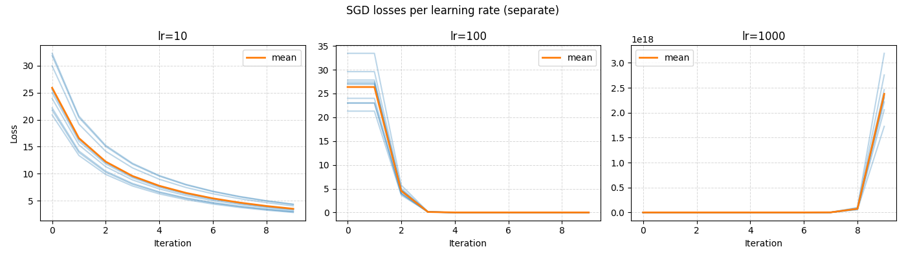
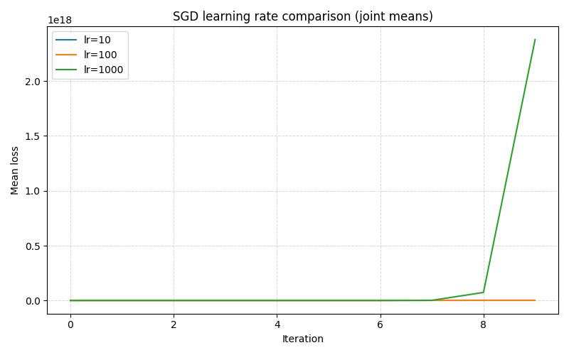
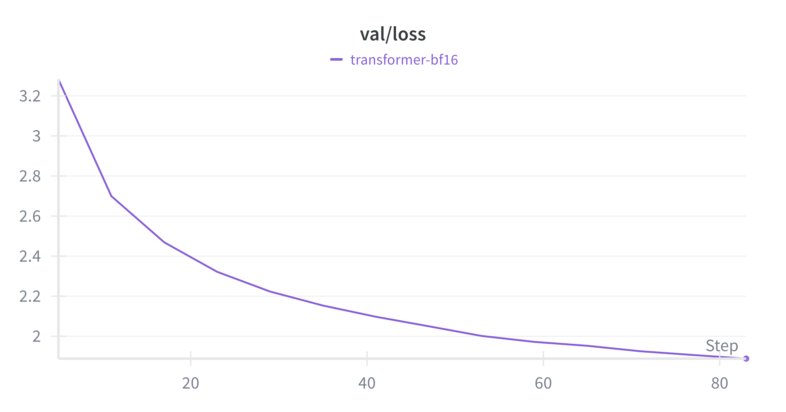

# NLPDL-HW1
#### Yutang Lin 2300017741
#### All problems requires testing and without question to answer are not listed below.
## 2. Byte-Pair Encoding (BPE) Tokenizer
### Problem 2.1
- `chr(0)` returns the number `0` unicode, which is a null char.
- the `__repr__()` function directly print the `chr(0)` in its byte representation `\x00`, while printing it will output null only, means there will be nothing outputed, e.g.
  ```python
  'this is a test\x00string' #__repr__()
  'this is a teststring' #printed
  ```
- If the text is printed, it will output the same text as there is no `chr(0)`, but the length will be extended since it occupies real storage position.

### Problem 2.2
- UTF-8 use variable length, each word takes 1 to 4 bytes, and compatible with ASCII. While UTF-16 and UTF-32 requires more bytes to encode the same sentence comparing with UTF-8. For purely english text, UTF-16 and UTF-32 takes 2 times and 4 times more bytes to encode than UTF-8.
- The function decode each byte individually, while UTF-8 may use multiple bytes to represent a word, an example would be
  ```python
    >>> def decode_utf8_bytes_to_str_wrong(bytestring: bytes):
    ...     return "".join([bytes([b]).decode("utf-8") for b in bytestring])
    ... 
    >>> decode_utf8_bytes_to_str_wrong("hello".encode("utf-8"))
    'hello'
    >>> decode_utf8_bytes_to_str_wrong("你好".encode("utf-8"))
    Traceback (most recent call last):
    File "<stdin>", line 1, in <module>
    File "<stdin>", line 2, in decode_utf8_bytes_to_str_wrong
    UnicodeDecodeError: 'utf-8' codec can't decode byte 0xe4 in position 0: unexpected end of data
  ```
- An example is the two-byte sequence `b'\xe4\x00'`. This is not a valid UTF-8 encoding and will raise a `UnicodeDecodeError` when trying to decode as UTF-8, because `0x00` is not a valid continuation byte following `0xe4`.

### Problem 2.4.2
The results are as follows:
```python
Trained TinyStories tokenizer in 11.64 minutes (RSS 0.07 GB).
Artifacts saved to /home/yutang/Desktop/PKUNLP/NLPDL-2025Fall/hw1_bpe_and_lm/outputs/tokenizer/tinystories_10k.
Longest token (15 bytes, id 7160): 'Ġaccomplishment'
Bottleneck from profiling: wait (threading.py:637) (599.18s cumulative).
Phase setup_seconds: 0.00s
Phase pretokenization_seconds: 89.34s
Phase merge_seconds: 609.26s
```
The training takes 11.64 minutes, consumes 0.07GB of memeory (not including pre-tokenization). The longest token is `Gaccomplishment` which seems abnormal. The main bottleneck is mergeing tokens, which takes around 10 minutes.

### Problem 2.6
- I evaluate the tokenizer on entire TinyStories training set, with 144 cpu and 288 process runs for `2 hours`. The following is the performance analysis. The compression ratio is around `4.11`, and the tokenization speed (per process) is around `1025 bytes/second`. Due to the multi-processing speed drop, the maximum speed is `6881 bytes/second`. It would take `1387.67 days` to tokenize Pile dataset for a single process. And for `1024` parallel process this time could be reduced to `1.355 days`.
- Why use `uint16`: After tokenizatikon, the ids are list of integers, the maximum representation range of `uint16` is `65535`, which is enough for most of the model's vocabulary size. Choosing `uint16` could save memory comparing with `uint32` or other representations, while making sure the ids are stroed correctly.
```bash
Time taken to encode training dataset: 7538.861671677791 seconds
Training dataset size: 541229710 tokens
Compression ratio for training dataset: 4.11441801300967 bytes/token
Speed for training dataset: 1025.632510813692 bytes/second
Analysis saved to outputs/tokenizer/tinystories_10k/analysis.json
```

## 4. LM Training
### Problem 4.2
I run 10 samples for each learning rate configuration, listed as below.



### Problem 4.4
- Each layer contains MHA ($4D^2$) and FFN ($8D^2$) with 2 RMSNorm ($2D$), alone with embedding and final layer norm and LM head, the LM contains $2VD+D+L(2D+12D^2)$ parameters in total, let the number be $P$. The gradients cost the same, and optimizer state cost double. The activations store embeddings ($BTD$), layers values $L(BTD+4BTD+BHT^2+BTD+4BTD+4BTD+BTD)$. Thus the total peak memory is $16P+4[BT(V+D(2+16L))+LBHT^2]$
- The predicted are as follows
```bash
Using device: cuda
Batch size  1: Memory used = 38520.48 MB
Batch size  2: Memory used = 57674.43 MB

============================================================
Linear regression results (with_grad (training)):
============================================================
a = 20084371456.00 bytes per batch element
b = 20307282944.00 bytes

Expression: memory_bytes = 20084371456.00 * batch_size + 20307282944.00

Or in GB: memory_gb = 18.705029 * batch_size + 18.912631

Verification (predicted vs actual):
Batch size  1: Predicted = 38520.48 MB, Actual = 38520.48 MB, Error = 0.00%
Batch size  2: Predicted = 57674.43 MB, Actual = 57674.43 MB, Error = 0.00%

Maximum batch size for 80GB memory (with_grad (training)):
  Total memory: 80 GB
  Constant overhead (b): 18.91 GB
  Available for activations: 61.09 GB
  Maximum batch size: 3

============================================================
Comparison:
============================================================
Memory per batch element (a):
  Training (with_grad): 18.705029 GB

Constant overhead (b):
  Training (with_grad): 18.91 GB

Using device: cuda
Testing different batch sizes with torch.no_grad() (inference)...
Measuring activation memory using torch.cuda memory tracking...

Batch size  1: Memory used = 6602.43 MB
Batch size  2: Memory used = 6798.75 MB
Batch size  4: Memory used = 7192.14 MB
Batch size  8: Memory used = 7976.70 MB
Batch size 16: Memory used = 9548.23 MB
Batch size 32: Memory used = 12688.48 MB
Batch size 64: Memory used = 18970.85 MB
Batch size 128: Memory used = 31535.60 MB

============================================================
Linear regression results (no_grad (inference)):
============================================================
a = 205858161.43 bytes per batch element
b = 6717593216.50 bytes

Expression: memory_bytes = 205858161.43 * batch_size + 6717593216.50

Or in GB: memory_gb = 0.191720 * batch_size + 6.256246

Verification (predicted vs actual):
Batch size  1: Predicted = 6602.72 MB, Actual = 6602.43 MB, Error = 0.00%
Batch size  2: Predicted = 6799.04 MB, Actual = 6798.75 MB, Error = 0.00%
Batch size  4: Predicted = 7191.68 MB, Actual = 7192.14 MB, Error = 0.01%
Batch size  8: Predicted = 7976.97 MB, Actual = 7976.70 MB, Error = 0.00%
Batch size 16: Predicted = 9547.54 MB, Actual = 9548.23 MB, Error = 0.01%
Batch size 32: Predicted = 12688.69 MB, Actual = 12688.48 MB, Error = 0.00%
Batch size 64: Predicted = 18970.98 MB, Actual = 18970.85 MB, Error = 0.00%
Batch size 128: Predicted = 31535.57 MB, Actual = 31535.60 MB, Error = 0.00%

Maximum batch size for 80GB memory (no_grad (inference)):
  Total memory: 80 GB
  Constant overhead (b): 6.26 GB
  Available for activations: 73.74 GB
  Maximum batch size: 384

============================================================
Comparison:
============================================================
Memory per batch element (a):
  Inference (no_grad):  0.191720 GB

Constant overhead (b):
  Inference (no_grad):  6.26 GB
```
- AdamW requires approximately 12 FLOPs per parameter per step: 3 for updating the first moment, 4 for updating the second moment, 5 for updating the parameters with weight decay. Thus the expression would be $12P$
- For GPT-2XL, forward FLOPs per step are approximately \( 2 P B T \). With \( P = 1.635 \times 10^9 \), \( B = 1024 \), \( T = 1024 \), forward FLOPs per step:
\[
2 \times 1.635 \times 10^9 \times 1024 \times 1024 = 3.427 \times 10^{15} \text{ FLOPs}
\]
Total FLOPs per step:
\[
3 \times 3.427 \times 10^{15} = 1.028 \times 10^{16} \text{ FLOPs}
\]
Total FLOPs for 400,000 steps:
\[
400000 \times 1.028 \times 10^{16} = 4.112 \times 10^{21} \text{ FLOPs}
\]
Time required:
\[
\frac{4.112 \times 10^{21}}{9.75 \times 10^{12}} = 4.218 \times 10^8 \text{ seconds}
\]
Convert to days:
\[
\frac{4.218 \times 10^8}{86400} = 4882.5 \text{ days}
\]
Thus, training would take approximately 4882.5 days.

## 5. Training Loop
### Problem 5.3
The code are in `basics/train_loop.py`. I train a `TransformerLM` with `basics/config/small_transformer.json` and a `LSTMLM` with `basics/config/small_lstm.json`. The validation loss curve for `TransformerLM` are as follows, while `LSTMLM` appears `nan` loss during training, thus I only trained it with `332800` samples. The `TransformerLM` is trained with `83200` samples.


## Generating Text
### Problem 6.1
The generation code for both `TransformerLM` and `LSTMLM` are in `basics/decode.py`. Following are several generation results, both using `temperature=0.8` and `top-p=0.9`.
#### TransformerLM
```txt
================================================================================
Prompt:
Once upon a time
--------------------------------------------------------------------------------
Generated:
Once upon a time, there was a big, soft cat. The cat had a very nice style. The cat loved to play with a ball. One day, the cat was playing with the ball when it got stuck in a tree. The cat tried to get the ball down, but it was too high.
A little bird saw the cat and wanted to help. The bird flew to the tree and tried to get the ball. The cat climbed the tree and got the ball for the bird. The cat was very happy. The bird and the cat played together all day.
The moral of the story is to always help others when they need it.
<|endoftext|>
================================================================================
================================================================================
Prompt:
There was a little boy
--------------------------------------------------------------------------------
Generated:
There was a little boy named Tim. He loved to play with his toys. One day, Tim's mom told him to be careful when he played. Tim did not listen and got very tired.
Tim went to his room and started to play. He saw his friend, Sam, playing with a toy car. Tim wanted to play with the car too. But Sam did not want to play with the car. Tim was sad and started to cry.
Then, Tim's mom came into the room. She saw Tim crying and asked, "Why are you crying, Tim?" Tim told her about the car and how he did not play with it. Sam's mom said, "We must clean your room and your toys." Tim learned that being careful is important. From that day on, he played with his toys and made sure not to break them.
<|endoftext|>
================================================================================
================================================================================
Prompt:
A girl named
--------------------------------------------------------------------------------
Generated:
A girl named Lily. Lily loved to play with her friends. They would play in the park all day. One day, Lily found a big box. She was very excited.
Lily opened the box and saw many things. She saw a small toy that looked like a book. It was a tiny toy. Lily loved her new toy. She played with it all day long.
But then, something unexpected happened. The toy turned into a magic wand! The magic wand could talk. The magic wand said, "Thank you for helping me. I will show you the magic wand." Lily was very surprised. She played with her new friend all day long.
<|endoftext|>
================================================================================
================================================================================
Prompt:
Sam is a naughty boy
--------------------------------------------------------------------------------
Generated:
Sam is a naughty boy, and he was scared. He did not want to be a good helper.
He ran back to his house and told his mom about his nightmare. His mom hugged him and said, "It's okay, Lily. The fairy is still your friend. She will be okay. She will be back soon."
The next day, Lily went back to the house. She was scared. She did not want the fairy to be scared. She wanted her family to be safe. She tried to be brave and strong. But she also knew that she was not scared.
At the end of the day, the fairy saw her family and her friends. She went back to her house. She was not scared anymore. She was very happy. She had a big, nice family. She was a brave and smart girl.
<|endoftext|>
================================================================================
================================================================================
Prompt:
A giant tree is
--------------------------------------------------------------------------------
Generated:
A giant tree is not good. It is not for eating. You should not have tried to give it to me. You should not be sad and sorry. You should not make a mess. You should listen to me."
Ben felt sorry. He said, "I am sorry, Lily. I was wrong. I should have listened to you. I was not a good friend. I did not care about you. I am sorry, Lily. I was wrong. I should have listened to you. I should have listened to you. I am sorry I was mean. I should have been careful. I should have listened to you. You are a good friend. I am sorry I was mean. I will not be my friend again. I am sorry, Lily. I am sorry, too. I will be nice. I will not bite again. I will not be my friend again. I will be your friend. I will always be your friend. I will be your friend. I will be nice to you. Please forgive me."
Lily and Ben nod. They say sorry to each other. They hug and kiss. They go to their homes. They go to their homes. They are happy. They have their own toys. They have each other. They are friends.
<|endoftext|>
================================================================================
```
#### LSTMLM
```txt
================================================================================
Prompt:
Once upon a time
--------------------------------------------------------------------------------
Generated:
Once upon a time, there was a little named. a, a saw a little big nice named Mimi. The had a Tom, Tom was to the it. One day, Tim was to the woods. They was together happy together. One day, the a little boy named Tim. Tom was very and he wanted to to the away, they was excited.
One day, a little bird named a Tom, a big red with small sun. The, then crab was very and stopped. They opened play trees with the park. One day, a dog found a big park. They wanted to her the big little, he liked to his the mom. The the, the wind was very playing. One day, she a unexpected very big in the Tom. Tim saw a store and used to her the long water. The he was a big big little rock. The man was happy and scared.
 day were unexpected big toy. He had out cat. He was with her hole and and she could to it. He was like a mom and the, so started to to the. They was to their toy.
One day, they found a pretty pretty slide. It were her and said " "No, I will know mom?" Tim asked's and. She looked and said, "I, you don love the you!"
"But can you!"
Her and said, "No, "It's a, Lily.
The fish smiled mom was not to the, but she came it. It could the door. He liked the mom was to the bus. But, that, then frog found his big blue big new. She made to the line. They saw to the trees. She was and she saw the oven in the rock. She had very, a bird, the unexpected letter. The little was unexpected two as Tim. The wind found a purple thing, Sam was to the kite. They saw down and took to a time ground, but it was proud happy for to his fun.
<|endoftext|>
================================================================================
================================================================================
Prompt:
There was a little boy
--------------------------------------------------------------------------------
Generated:
There was a little boy was house.
"Maybe want I too!" Tim says't too.
One day, Tom saw a big big sound. The, something and came a box and went to to a park. Tim was so to the, but and he could to the still.
"Thank you, it be to be the Bob."
"Thank his a toy! Lily is to the special and and, a, Tom bird became very. They had the shapes and played, laughing of the lot.
<|endoftext|>
================================================================================
================================================================================
Prompt:
A girl named
--------------------------------------------------------------------------------
Generated:
A girl named Tim was the little with the. It said, "Don!Hi, you! I can do be to me!" Lily ran very help big and said, "I, you am okay, I want to your again." They could that and that and they they all. They were and were, They.<|endoftext|>
================================================================================
================================================================================
Prompt:
Sam is a naughty boy
--------------------------------------------------------------------------------
Generated:
Sam is a naughty boy. The bird was up out mom was to a walk and and to to the toy. They found them and decided a on the ground.
<|endoftext|>
================================================================================
================================================================================
Prompt:
A giant tree is
--------------------------------------------------------------------------------
Generated:
A giant tree is not. She was very too and said, " "You will have you. You can be to to be help."
"Bob, Lucy's good," play ball. She was of to the town again.

Lily said, "I need to fly your the the house. It was and ran on the room. The, they began to her a room and said, "Thank you, I, I are to your to the other!"
Lily and he said, "Hi, you't! You are just get he. It looked you mom was the bike with the seat. They saw the big bird. They was to its table and couldn't, they not help!
<|endoftext|>
================================================================================
```